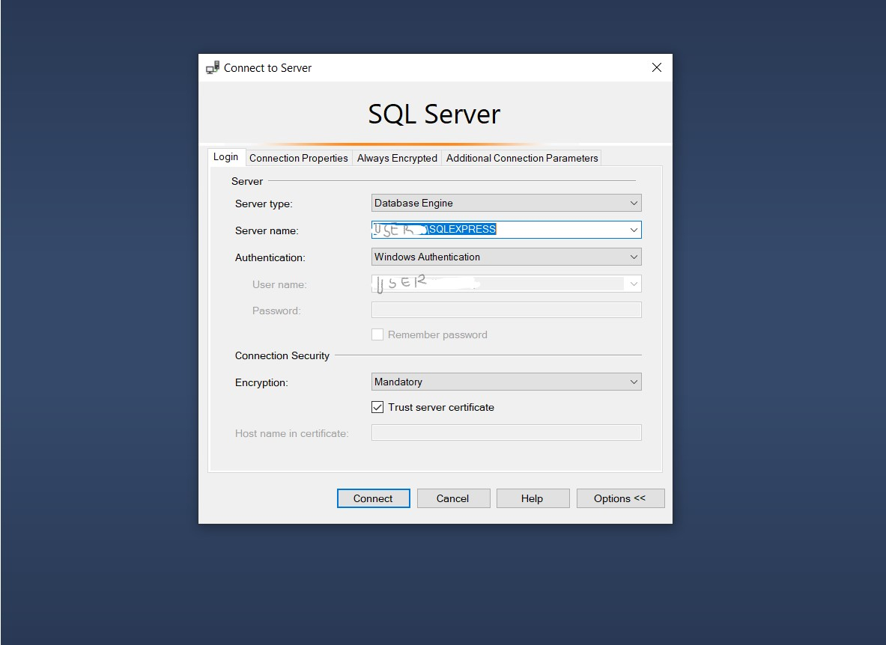
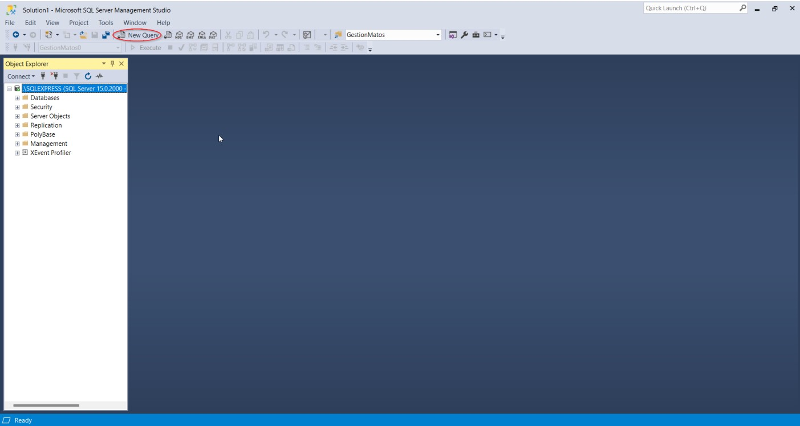
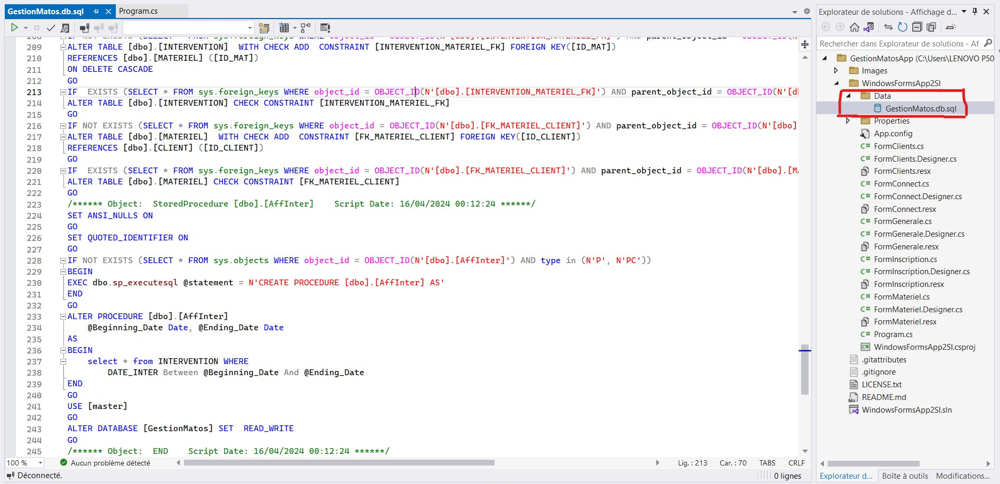
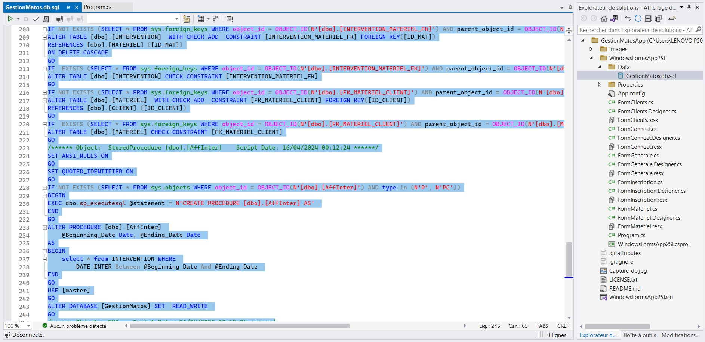
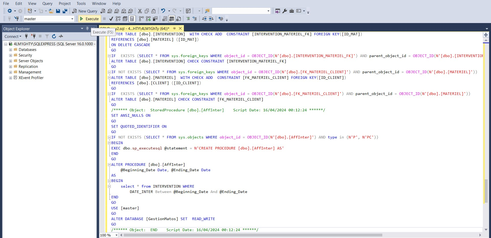
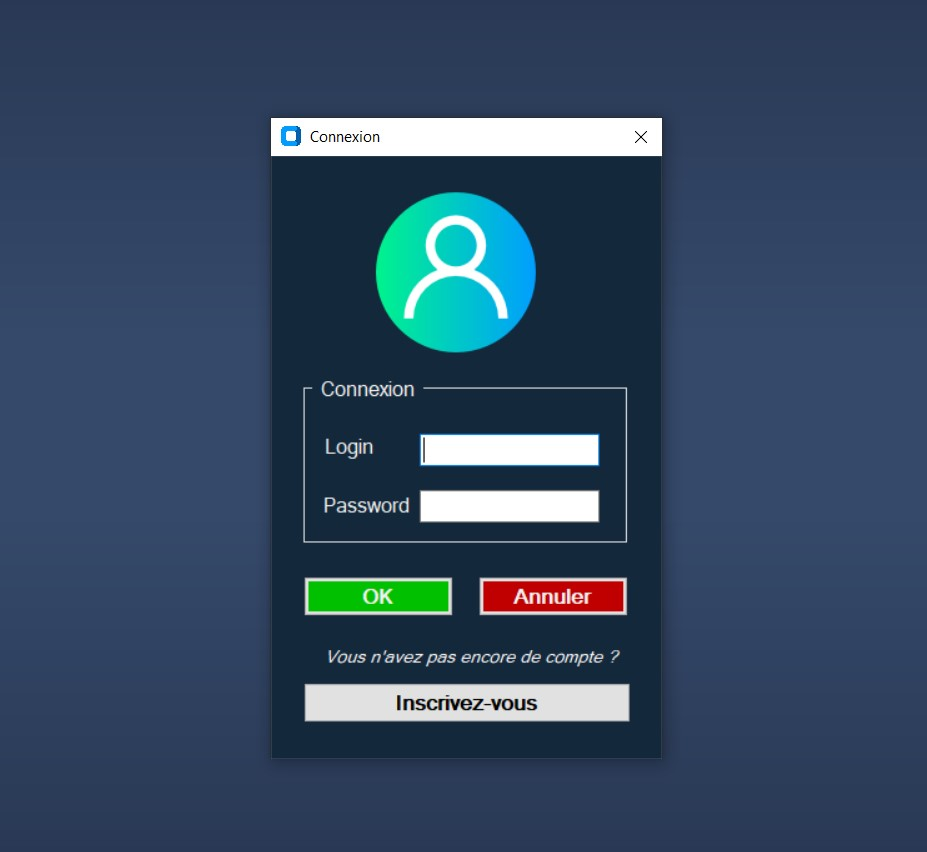
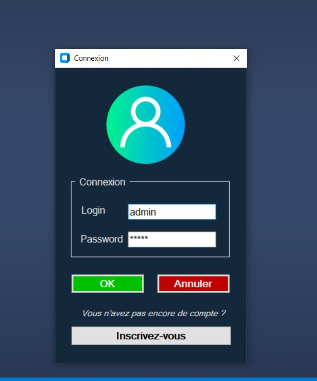
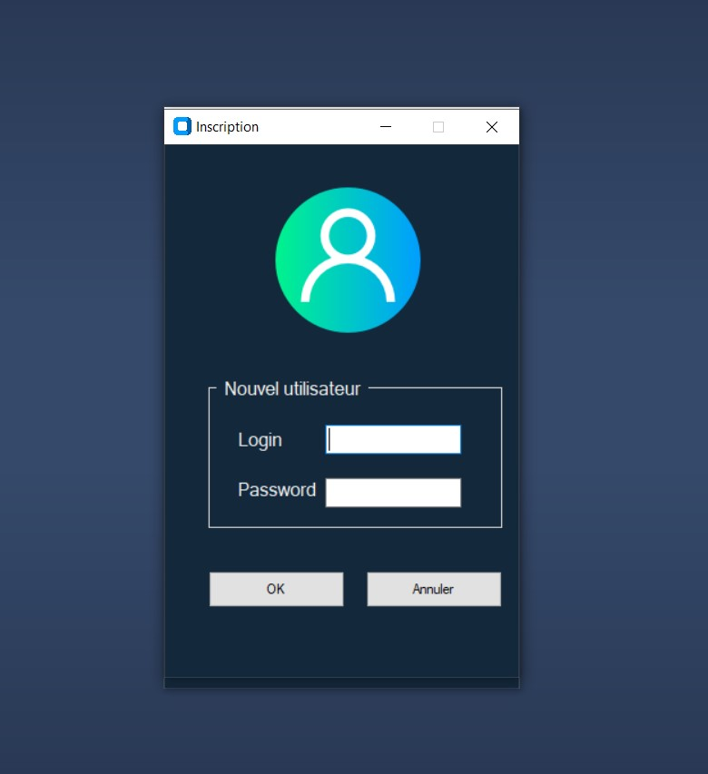
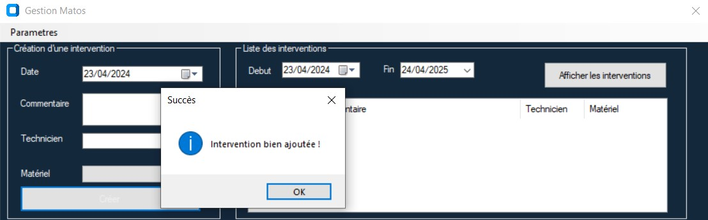

  

  
  
  
  

  
  
  
  
  

## Description
La société « GestionMatos » est une entreprise de maintenance d’équipements informatiques. Elle travaille pour le compte de plusieurs sociétés (ses clients) et ce sur divers sites. Cette maintenance peut être préventive (programmée à l'avance), urgente (calculée sur la base du MTBF du matériel) ou curative (suite à une panne). Elle dispose d'un ensemble d'intervenants sur toute la France.

## Demo :

Aucune démo disponible pour le moment.

## Prérequis / Conseils / Exigences :

Pour faire fonctionner GestionMatosApp, vous aurez besoin des logiciels et technologies suivants :

- Visual Studio (de préférence) : Comme IDE pour C# vous pouvez aussi bien utiliser Jetbrains Rider si vous le souhaitez ou que vous êtes plus à l'aise avec ça.
- Microsoft SQL Server Express (version gratuite) : Une version gratuite de SQL Server adaptée pour les petites applications et les environnements de développement.
- Microsoft SQL Server Management Studio (SSMS)[Facultatif] : Un outil de gestion de base de données graphique utilisé pour interagir avec les bases de données SQL Server, idéal pour la création et la gestion des bases de données.

## Configuration de l'Application :

Avant de lancer l'application, veillez à effectuer les étapes suivantes :

1. Cloner le dépôt : `git clone https://github.com/Monsieur9Bre99/GestionMatosApp.git`

   ### Arborescence : 

   # GestionMatosApp/
    |-- Images/
    |-- WindowsFormsApp2SI/
        ||-- Bin/
        ||-- Data/
            ||-- GestionMatos.db.sql
        ||-- obj/
        ||-- Properties/
        ||--App.config
        ||--FormClients.cs
        ||--FormClients.Designer.cs
        ||--FormClients.resx
        ||--FormConnect.cs
        ||--FormConnect.Designer.cs
        ||--FormConnect.resx
        ||--FormGenerale.cs
        ||--FormGenerale.Designer.cs
        ||--FormGenerale.resx
        ||--FormInscription.cs
        ||--FormInscription.Designer.cs
        ||--FormInscription.resx
        ||--FormMateriel.cs
        ||--FormMateriel.Designer.cs
        ||--FormMateriel.resx
        ||--Program.cs
        ||--WindowsFormsApp2SI.csproj
    |--.gitattributes
    |--.gitignore
    |--LICENSE.txt
    |--README.md
    |--WindowsFormsApp2SI.sln

2. Ouvrez le dossier ou Lancez simplement le fichier de solution `WindowsFormsApp2SI.sln` dans votre environnement de développement C# préféré (par exemple, Visual Studio).
3. Construire la solution pour résoudre les dépendances et compiler le code.

## Installation avec SQL Server Express :

Pour installer Gestion Matos dans votre environnement de développement local avec SQL Server Express, suivez les étapes suivantes :

 1. **Télécharger SQL Server Express :**   [Cliquer ici](https://www.microsoft.com/fr-fr/sql-server/sql-server-downloads)

 2. **Installer SQL Server Express :**   Suivez les instructions d'installation fournies par Microsoft.

 3. **Télécharger SQL Server Management Studio (SSMS) :** [Cliquer ici](https://docs.microsoft.com/en-us/sql/ssms/download-sql-server-management-studio-ssms?view=sql-server-ver15)

 4. **Installer SQL Server Management Studio (SSMS) :**   Suivez les instructions d'installation fournies par Microsoft.

## Configuration de la Base de Données :

Une fois SQL Server Express et SSMS installés, suivez les étapes suivantes pour configurer la base de données :

1. Ouvrez SQL Server Management Studio (SSMS).
    

2. Connectez-vous à votre instance de SQL Server Express.
    

3. Copiez et Exécutez le script SQL fourni dans le référentiel sous `GestionMatosApp/WindowsFormsApp2SI/Data/GestionMatos.db.sql` pour créer les tables et les données nécessaires.
    
    
    

## Test

Pour tester l'application, utilisez les informations d'identification suivantes :

- Nom d'utilisateur : Admin

- Mot de passe : Admin

Veillez à utiliser ces informations d'identification pour vous connecter à l'application et vérifier que toutes les caractéristiques et fonctionnalités fonctionnent comme prévu.

## Error & Troubleshooting

Si vous rencontrez des problèmes ou des erreurs pendant le processus d'installation ou pendant l'utilisation de l'application, veuillez vous référer à l'issue tracker du projet sur le dépôt GitHub pour les problèmes connus et les solutions possibles. Si votre problème persiste, n'hésitez pas à me contacter et à me fournir des informations détaillées sur l'erreur que vous avez rencontrée.

## License
Ce projet est sous licence [MIT License](LICENSE), ce qui vous permet d'utiliser, de modifier et de distribuer le code librement. Veuillez vous référer au fichier de licence pour plus d'informations.

## Contributions
Les contributions à ce projet sont les bienvenues ! Si vous trouvez des bugs ou souhaitez suggérer de nouvelles fonctionnalités, veuillez soumettre un problème ou créer une demande d'extension sur le dépôt GitHub. Veillez à respecter le style de code du projet et les conventions décrites dans les directives de contribution.

### Superviseur

<table>
  <tr align="center">
    <td>
        <a href="https://github.com/ESSAMAMI">
        
         
        <b>STEPHANE HALIMI</b></a>
    </td>
 </tr>
<table>

## Acknowledgements
Je souhaite exprimer ma gratitude et ma reconnaissance à tous les contributeurs de ce projet, en particulier à mon Professeur Stéphane Halimi pour ses précieux conseils et à tous mes collègues de classe. Vos avis, vos commentaires et vos conseils techniques ont été inestimables pour la réalisation de ce projet.

THANKS.

## Contact
- Portfolio: https://www.breroot.fr/
- linkedIn: https://fr.linkedin.com/in/bre-sanctifi%C3%A9-36b3a822b

<h3>
GestionMatosApp - Application de Gestion des Équipements Informatiques - @breroot
</h3>
